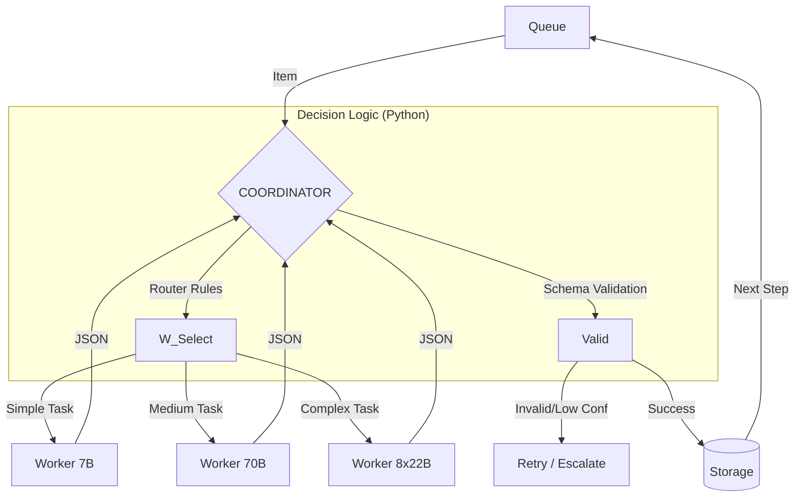

# 🧠 Princípios Fundamentais

*   **O Coordinator NÃO é um LLM:** É código (Python) determinístico, barato e auditável.
*   **Workers são Stateless:** Não há memória entre chamadas. Entrada JSON → Processamento → Saída JSON.
*   **Comunicação Estrita:** Nada de texto livre. Tudo é validado via Schema.
*   **Hierarquia de Modelos:** O modelo certo para a tarefa certa (7B vs 70B vs 8x22B).

# 🏗 Arquitectura

## O Coordinator (The Shift Manager)
O coração do sistema. Não alucina, não se cansa e não custa tokens.

*   **Role:** Gestor de fila, Validador de Schema, Roteador.
*   **Tech:** Python (não AI).
*   **Responsabilidades:**
    *   Recebe trabalho da Queue.
    *   Decide (via regras if/else) qual Worker chamar.
    *   Valida a estrutura do JSON de saída.
    *   Gere retry, backoff e escalonamento de modelos.
    *   Persiste dados no Storage (Postgres/Vector DB).

## Os Workers (The Specialists)

| Tier | Modelo Exemplo | Custo/Speed | Função Principal |
| :--- | :--- | :--- | :--- |
| **Worker 7B** | Llama-3-8B / Mistral | ⚡ Fast / $ Low | Triage, Extração Simples, Deduplicação. |
| **Worker 70B** | Llama-3-70B | ⚖️ Medium | Classificação, Análise Semântica, Design de PoC. |
| **Worker 8x22B** | Mixtral 8x22B / GPT-4 | 🧠 Heavy / $$ High | Relatórios Finais, Casos Complexos, Escalonamento. |

# 🔄 Workflow de Comunicação

O fluxo é unidirecional e controlado pelo Coordinator.

# 📋 Task Pipeline & Routing

Exemplo real de processamento de vulnerabilidades (CVE):

1.  **TRIAGE (Worker 7B)**
    *   **Input:** Raw CVE, advisory.
    *   **Objetivo:** Filtrar ruído. É relevante?
    *   **Output:** `{ relevance: 0-100, category_guess, needs_deeper: bool }`

2.  **CLASSIFY (Worker 70B)**
    *   **Input:** Item triado.
    *   **Objetivo:** Categorização semântica precisa.
    *   **Output:** `{ category, platform, impact, confidence }`
    *   **Regra:** Se confidence < 70% → ESCALATE.

3.  **ANALYZE (Worker 70B)**
    *   **Input:** Item classificado + contexto.
    *   **Objetivo:** Avaliar risco real e caminhos de exploit.
    *   **Output:** `{ risk_score, exploit_path, poc_viable: bool }`

4.  **POC DESIGN (Worker 70B ou 8x22B)**
    *   **Input:** Análise profunda.
    *   **Objetivo:** Criar passos de reprodução.
    *   **Output:** `{ poc_code, test_steps, expected_result }`

5.  **LAB TEST (System - No LLM)**
    *   **Input:** Script do PoC.
    *   **Ação:** Spin up microVM → Executa → Captura Output → Destroy.
    *   **Output:** `{ success: bool, artifacts: [] }`

6.  **REPORT (Worker 8x22B)**
    *   **Input:** Todo o contexto acumulado + Evidências do Lab.
    *   **Objetivo:** Relatório final para humanos (formato HackerOne/Jira).
    *   **Output:** Markdown formatado.

# 📈 Matriz de Escalonamento (Escalation Rules)

O Coordinator decide quando "chamar o supervisor" (modelo maior).

| Condição | Ação do Coordinator |
| :--- | :--- |
| Worker 7B conf < 50% | Retry com Worker 70B |
| Schema Inválido (2x) | Escala para modelo superior |
| Worker 70B conf < 70% | Escala para Worker 8x22B |
| Falha na Classificação | Escala para Worker 8x22B |
| Tarefa é "REPORT" | Direto para Worker 8x22B (Qualidade crítica) |
| Falha Geral (3x) | Envia para Dead-letter Queue + Alerta Humano |

# 🚫 Anti-Patterns (O que NÃO fazemos)

*   ❌ **Agentes conversam livremente:** Nunca. Workers respondem a prompts estruturados com JSON.
*   ❌ **Agente A pergunta ao Agente B:** O Coordinator é o único que decide quem fala a seguir.
*   ❌ **Agentes "negociam":** Se o output é mau, o código escala. Não há debate.
*   ❌ **Memória Implícita:** Workers não lembram do passado. Todo o contexto necessário é injetado no prompt a cada passo.
*   ❌ **LLM como Router:** O routing é baseado em regras lógicas, não em "vibe" de um LLM.

# 🛠 Tech Stack Recomendada

*   **Coordinator:** Python 3.10+ (Pydantic para validação)
*   **Orchestration:** Temporal.io / Celery / Arq
*   **Inference:** vLLM / Ollama (para local) ou API Providers (Groq/OpenAI/Anthropic)
*   **Storage:** PostgreSQL (JSONB) + Qdrant/Chroma (Vector)

> "Determinístico = previsível = debuggável."
